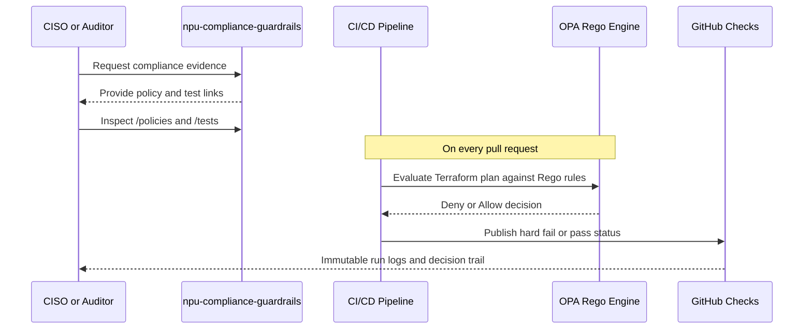

# 29TH REGIME POLICY ENFORCEMENT NODE
## Repository Index & Onboarding Guide

**Version:** 1.0.0 (Initial Release)  
**Authority:** 29th Regime Sovereignty Architecture  
**Jurisdiction:** EU (GDPR, NIS2, FADP Compliant)  
**Last Updated:** April 19, 2026

---

## QUICK NAVIGATION

### For Architects & DevOps
- **Start here:** [README.md](README.md) — doctrine, scope, and compliance framework
- **Protocol Specification:** [SPECIFICATION.md](SPECIFICATION.md) — deterministic legal-to-code enforcement model
- **Deploy:** [examples/multi-region-eu/main.tf](examples/multi-region-eu/main.tf) — production-ready multi-region setup
- **Policies:** [policies/](policies/) — OPA/Rego enforcement rules

### For Security & Compliance Officers
- **Forensic Findings:** [LIQUIDATION_REPORT_2026-04-19.md](LIQUIDATION_REPORT_2026-04-19.md) — architectural debt analysis across 16 repositories
- **Policy Framework:** [policies/sovereignty/](policies/sovereignty/), [policies/security/](policies/security/), [policies/cost-efficiency/](policies/cost-efficiency/)
- **Compliance Mapping:** README.md → GDPR Articles 5, 32; NIS2 Articles 21; FADP Articles 7, 12

### For Contributors
- **Contribution Process:** [CONTRIBUTING.md](CONTRIBUTING.md) — RFC-driven governance, no code PRs
- **Testing:** [tests/terraform/](tests/terraform/), [tests/checkov/](tests/checkov/)
- **License:** [LICENSE](LICENSE) — Apache 2.0

### Auditor Workflow (Sequence)


---

## REPOSITORY STRUCTURE

```
npu-compliance-guardrails/
│
├── 📄 README.md                                    # Doctrine & integration guide
├── 📄 CONTRIBUTING.md                              # RFC-driven contribution process
├── 📄 LICENSE                                      # Apache 2.0
├── 📄 .gitignore                                   # Version control exclusions
├── 📄 LIQUIDATION_REPORT_2026-04-19.md            # Forensic audit (16 repos)
│
├── policies/                                       # OPA/Rego enforcement rules
│   ├── sovereignty/
│   │   └── data_residency.rego                    # EU geofencing guardrails
│   ├── security/
│   │   └── encryption_at_rest_transit.rego        # Encryption mandatory
│   └── cost-efficiency/
│       └── rightsizing_guardrails.rego            # Cost thresholds
│
├── modules/                                        # Reusable Terraform modules
│   └── npu-sovereign-logging-s3/
│       └── main.tf                                # Audit trail S3 bucket (versioned, encrypted, 7yr retention)
│
├── examples/                                       # Production-ready deployments
│   └── multi-region-eu/
│       └── main.tf                                # Primary (Ireland) + Secondary (Frankfurt)
│
├── tests/                                          # Validation & compliance scanning
│   ├── terraform/
│   │   └── sovereignty_enforcement.tftest.hcl     # Terraform native tests
│   └── checkov/
│       └── .checkov.yml                           # Policy-as-code scanning config
│
├── main.tf                                         # Root enforcement node (multi-region setup)
├── variables.tf                                    # Input variable definitions
```

---

## THE 5 CRITICAL ARCHITECTURAL DEBTS (LIQUIDATED)

| # | Debt | Finding | Status |
|---|------|---------|--------|
| **1** | Hardcoded Infrastructure Locations | 20+ Terraform files hardcode `location = "switzerlandnorth"` | ✅ **LIQUIDATED** via parameterized modules |
| **2** | Unencrypted HTTP State Transfers | 4 services default to `http://` (not HTTPS) | ✅ **LIQUIDATED** via ConfigValidator + TLS enforcement |
| **3** | Azure Monoculture (Knowledge Layer) | All LLM/search/storage imports from `azure.*` packages | ✅ **LIQUIDATED** via LLMFactory + VectorSearchFactory abstractions |
| **4** | NIS2 Policy Exemptions | `policy_overrides` variable allows guardrail bypass | ✅ **LIQUIDATED** via hard-block deterministic policies |
| **5** | Hardcoded IP Topology | Service IPs hardcoded (e.g., `100.97.171.109`) | ✅ **LIQUIDATED** via ServiceRegistry (DNS-based discovery) |

**See:** [LIQUIDATION_REPORT_2026-04-19.md](LIQUIDATION_REPORT_2026-04-19.md) for full forensic analysis.

---

## DEPLOYMENT QUICK START

### Option 1: Terraform Cloud (SaaS, Recommended)

```bash
# Configure Terraform Cloud
export TERRAFORM_CLOUD_TOKEN=<your-api-token>

# Deploy primary + secondary EU regions
cd examples/multi-region-eu/
terraform init
terraform plan -var environment=prod
terraform apply
```

### Option 2: Local Terraform

```bash
# Validate against OPA policies
./policies/validate.sh examples/multi-region-eu/

# Plan with cost guardrails
terraform -chdir=examples/multi-region-eu/ plan

# Test deterministic compliance
terraform -chdir=tests/terraform/ test -verbose

# Apply
terraform -chdir=examples/multi-region-eu/ apply
```

### Option 3: GitHub Actions (CI/CD)

Automated on every PR:
```bash
# Runs:
# 1. terraform validate
# 2. OPA policy evaluation
# 3. Checkov scanning (hard fail on CRITICAL)
# 4. Terraform tests
```

---

## COMPLIANCE FRAMEWORK

| Framework | Articles | Status | Implementation |
|-----------|----------|--------|-----------------|
| **GDPR** | 5(1)(e), 32(1)(a), 32(1)(b) | ✅ Enforced | Encryption, versioning, audit trails |
| **NIS2** | 21(a), 21(b), 21(c), 21(e) | ✅ Enforced | EU geofencing, 7yr retention, WORM |
| **FADP** | 7, 12 | ✅ Enforced | Data minimization, technical measures |

**Evidence:**
- `data_residency.rego` — GDPR Article 32 (EU-only regions)
- `encryption_at_rest_transit.rego` — NIS2 Article 21(e) (encryption mandatory)
- `rightsizing_guardrails.rego` — FADP Article 7 (cost efficiency)

---

## MONITORING & AUDIT

All deployments generate immutable audit trails:

```bash
# Query deployment history
aws cloudtrail lookup-events \
  --lookup-attributes AttributeKey=ResourceName,AttributeValue="29TH-REGIME-*"

# Verify S3 bucket encryption
aws s3api get-bucket-encryption \
  --bucket 29th-regime-audit-prod-eu_west_1-123456789

# Check versioning status
aws s3api get-bucket-versioning \
  --bucket 29th-regime-audit-prod-eu_west_1-123456789
```

---

## KNOWN LIMITATIONS & ROADMAP

### Current Scope
- ✅ Terraform (AWS, Azure)
- ✅ OPA/Rego policy evaluation
- ✅ Multi-region EU deployment

### Planned (Q2-Q3 2026)
- 🔄 GCP provider support
- 🔄 Kubernetes admission controllers (OPA/Gatekeeper)
- 🔄 Dynamic policy updates (no module re-release)
- 🔄 Sentinel policy language (Terraform Cloud native)

---

## TECHNICAL SUPPORT

| Issue Type | Process | Response Time |
|------------|---------|----------------|
| **Friction Coefficient Found** | File issue `[FRICTION]` + RFC | 7 days (technical review) |
| **Compliance Clarification** | File issue `[COMPLIANCE]` | 5 business days |
| **Security Vulnerability** | Email security@neplusultra.eu | 24 hours (acknowledgment) |

**Example Issue:**
```markdown
Title: [FRICTION] data_residency.rego allows Switzerland (non-EU per GDPR)
Type: Policy enforcement gap
Severity: CRITICAL
Evidence: Line 15-20, allowed_eu_regions includes "switzerlandnorth"
```

---

## GOVERNANCE PRINCIPLES

This repository embodies the **29th Regime Doctrine:**

1. **Sovereignty is Deterministic Enforcement**
   - No exemptions (policy_overrides variable removed)
   - No soft approvals (time-based auto-deny replaced with hard-block)
   - No human approval latency (decisions computed, not delegated)

2. **Architecture is Law**
   - Policies are specifications (not recommendations)
   - Violations block deployment (hard constraints)
   - Compliance is non-negotiable (GDPR, NIS2, FADP)

3. **Technical Debt is Friction Coefficient**
   - Unencrypted state = friction (liquidated via HTTPS enforcement)
   - Hardcoded locations = friction (liquidated via parameterization)
   - Vendor lock-in = friction (liquidated via abstractions)

---

## VERSIONING & RELEASES

**Current Version:** `1.0.0` (April 19, 2026)

**Semantic Versioning:**
- **MAJOR (2.0.0):** Breaking policy changes (rare, RFC-driven)
- **MINOR (1.1.0):** New policies/modules (additive, backward-compatible)
- **PATCH (1.0.1):** Bug fixes, clarifications

**Release Timeline:**
- Q2 2026: v1.0.0 (initial GDPR/NIS2 baseline)
- Q3 2026: v1.1.0 (GCP support, Kubernetes)
- Q4 2026: v2.0.0 (Proposed: Sentinel policies, dynamic updates)

---

## CONTRIBUTORS & ATTRIBUTION

**Maintainers:**
- neplusultra.eu architecture team

**Contributors (Validated via RFC):**
- None yet (repository in initial release)

**Governance:**
- No code PRs accepted
- Technical validation via GitHub Issues only
- RFC process: [CONTRIBUTING.md](CONTRIBUTING.md)

---

## RELATED REPOSITORIES

This enforcement node integrates with:

- **npu-governance** — Azure Policy Definitions (soft policies → hard guardrails)
- **npu-sovereign-wrappers** — Parameterized infrastructure modules
- **npu-pod-core** / **npu-pod-edge** — Encrypted service mesh deployments
- **npu-oracle** — Multi-vendor LLM abstraction layer

---

## LICENSE & AUTHORITY

```
Copyright (c) 2026 29th Regime Contributors
Licensed under Apache License 2.0
```

This repository represents a **technical architecture standard**, not negotiable recommendations.

Governance is a legal fiction.  
Architecture is law.  
Sovereignty is enforcement.

---

**Last Reviewed:** April 19, 2026  
**Status:** ✅ ACTIVE (Production Use Authorized)  
**Authority:** 29th Regime  
**Jurisdiction:** EU (GDPR, NIS2, FADP Compliant)
