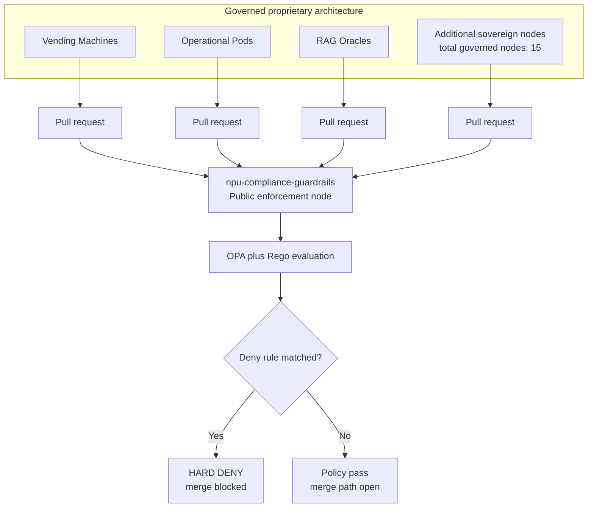
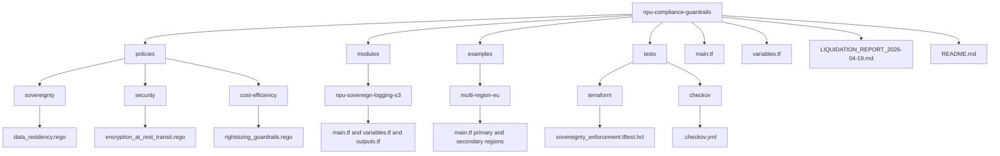
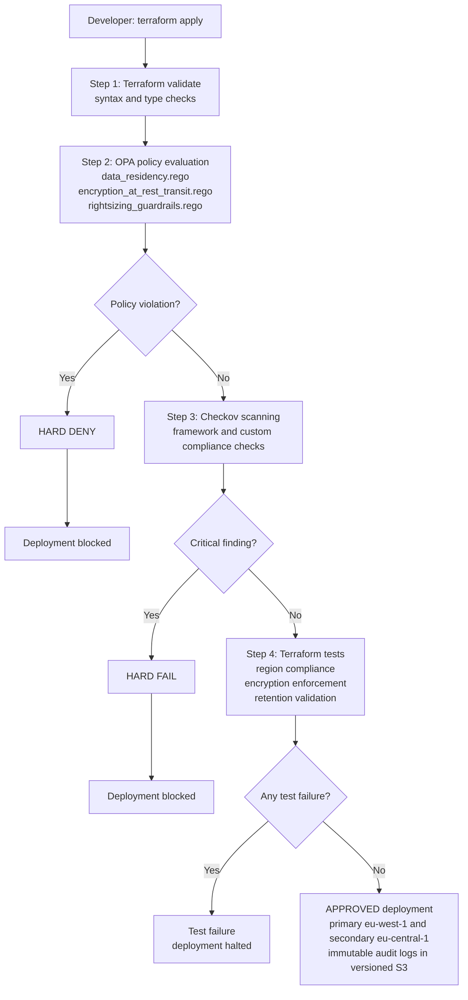

# 29TH REGIME // POLICY ENFORCEMENT NODE

```
╔═══════════════════════════════════════════════════════════════════════════╗
║                                                                           ║
║  SOVEREIGNTY IS DETERMINISTIC ENFORCEMENT                               ║
║  Governance is a legal fiction; Architecture is law.                     ║
║                                                                           ║
║  29th Regime — European Digital Sovereignty & Technical Debt Liquidation  ║
║  https://neplusultra.eu                                                  ║
║                                                                           ║
╚═══════════════════════════════════════════════════════════════════════════╝
```

---

## DOCTRINE

This repository is not a "best practices guide" or a set of "recommendations." These are **deterministic guardrails**—hard constraints embedded in code that liquidate architectural debt and enforce sovereign digital infrastructure.

Governance frameworks (GDPR, NIS2, FADP) establish *legal requirements*. This codebase makes those requirements *executable*:

- **No exemptions.** Policy overrides and soft approval workflows are abolished.
- **No human approval latency.** Decisions computed, not delegated.
- **No vendor lock-in.** Infrastructure parameterized for multi-cloud, multi-region EU deployment.
- **No unencrypted state.** HTTPS-only, encryption-at-rest mandatory, audit trails immutable.

The 29th Regime doctrine: *Governance is a legal fiction; Sovereignty is deterministic enforcement.*

Protocol specification: [SPECIFICATION.md](SPECIFICATION.md)

### Architecture Overview


---

## SCOPE

This enforcement node covers **three operational domains**:

### 1. **Perimeter Enforcement** (Terraform HCL)
- **Location:** `policies/sovereignty/`, `policies/security/`, `policies/cost-efficiency/`
- **Authority:** GDPR Article 32 (technical measures), NIS2 Article 21 (supply chain security), FADP (Swiss GDPR parity)
- **Enforcement Type:** Hard-deny policies with zero exemptions
- **Regions:** `eu-west-1` (Ireland), `eu-central-1` (Frankfurt), `northeurope` (Stockholm), `germanywestcentral` (Frankfurt)

**Critical Guardrails:**
- Deny all resources deployed outside EU jurisdiction
- Enforce encryption at rest (customer-managed KMS keys)
- Mandate HTTPS/TLS 1.2+ for all state transfers
- Block public access to audit trails
- Enforce 7-year retention (NIS2 compliance)

### 2. **Core Enforcement** (OPA/Rego Policies)
- **Location:** `policies/sovereignty/data_residency.rego`, `policies/security/encryption_at_rest_transit.rego`, `policies/cost-efficiency/rightsizing_guardrails.rego`
- **Authority:** Policy-as-code governance (deterministic, immutable)
- **Enforcement Mechanism:** Terraform Cloud policy enforcement, Checkov scanning in CI/CD

**Critical Policies:**
- `data_residency.rego`: Geofencing (EU-only)
- `encryption_at_rest_transit.rego`: Encryption mandatory at rest and in transit
- `rightsizing_guardrails.rego`: Cost-efficiency compliance (no oversized instances without approval)

### 3. **Example Architectures** (Production-Ready)
- **Location:** `examples/multi-region-eu/`
- **Topology:** Primary (Ireland) + Secondary (Frankfurt) with cross-region replication
- **Modules:** Reusable `npu-sovereign-logging-s3` module for audit trail infrastructure

---

## USAGE

### Quick Start: Deploy Sovereign Audit Trail

```bash
# Clone repository
git clone https://github.com/neplusultra/npu-compliance-guardrails.git
cd npu-compliance-guardrails

# Set environment
export TF_VAR_environment="prod"
export TF_VAR_primary_region="eu-west-1"
export TF_VAR_secondary_region="eu-central-1"

# Validate against OPA policies
opa eval -d policies/sovereignty/data_residency.rego -d policies/security/ \
  -i <(terraform show -json) \
  "data.sovereign.deny"

# Plan infrastructure
terraform -chdir=examples/multi-region-eu plan -out=tfplan

# Scan with Checkov (policy enforcement)
checkov -d examples/multi-region-eu/ \
  --framework terraform \
  --config-file tests/checkov/.checkov.yml

# Apply (hard constraints enforced at plan time)
terraform -chdir=examples/multi-region-eu apply tfplan

# Test deterministic compliance
terraform -chdir=tests/terraform test -verbose
```

### Integration: CI/CD Pipeline (GitHub Actions)

```yaml
# .github/workflows/sovereignty-enforcement.yml

name: 29TH REGIME — Policy Enforcement

on: [pull_request, push]

jobs:
  enforce:
    runs-on: ubuntu-latest
    steps:
      - uses: actions/checkout@v3
      
      - uses: hashicorp/setup-terraform@v2
        with:
          terraform_version: 1.6.0
      
      - name: Terraform Validate
        run: terraform -chdir=examples/multi-region-eu validate
      
      - name: OPA Policy Evaluation
        run: |
          curl -L https://openpolicyagent.org/downloads/latest/opa_linux_amd64 \
            -o opa && chmod +x opa
          ./opa test policies/ -v
      
      - name: Checkov Scan (Hard Enforcement)
        uses: bridgecrewio/checkov-action@master
        with:
          directory: examples/multi-region-eu/
          framework: terraform
          quiet: false
          soft_fail: false  # HARD FAIL on policy violation
          config_file: tests/checkov/.checkov.yml
      
      - name: Terraform Tests
        run: terraform -chdir=tests/terraform test
```

### Integration: Terraform Cloud (SaaS)

```hcl
# Root workspace configuration

terraform {
  cloud {
    organization = "29th-regime-oss"
    
    workspaces {
      name = "sovereignty-enforcement"
    }
  }
}

# Policy Set: Linked to OPA policies
# https://app.terraform.io/app/29th-regime-oss/policies/

# Cost Estimation: Enforced via policy set
# Cost thresholds: max 100k EUR/month (prod), 20k EUR/month (staging)
```

---

## COMPLIANCE

This repository enforces the following regulatory frameworks:

### **GDPR** (General Data Protection Regulation)
- **Article 32:** Technical and organizational measures (encryption, audit trails, access control)
  - Implementation: `policies/security/encryption_at_rest_transit.rego`
- **Article 5(1)(e):** Integrity and confidentiality (WORM audit trails, versioning)
  - Implementation: `modules/npu-sovereign-logging-s3/main.tf` (versioning, lifecycle policies)

### **NIS2** (Network and Information Security Directive 2)
- **Article 21:** Supply chain security (vendor lock-in prevention, multi-region redundancy)
  - Implementation: `policies/sovereignty/data_residency.rego`, `examples/multi-region-eu/`
- **Article 21(b):** 7-year log retention
  - Implementation: `modules/npu-sovereign-logging-s3/main.tf` (retention_days = 2555)
- **Article 21(e):** Encryption and pseudonymization
  - Implementation: `policies/security/encryption_at_rest_transit.rego`

### **FADP** (Federal Act on Data Protection — Switzerland)
- **Article 7:** Lawfulness and data minimization
  - Implementation: `examples/multi-region-eu/main.tf` (cost-efficiency guardrails)
- **Article 12:** Technical measures (encryption, audit logging)
  - Implementation: `policies/security/encryption_at_rest_transit.rego`

### **Architectural Standards**
- **Deterministic Enforcement:** Policies not recommendations; failures block deployment
- **EU Data Residency:** No non-EU cloud regions permitted (hard constraint)
- **Encryption by Default:** HTTPS-only, KMS-encrypted storage mandatory
- **Audit Trail Integrity:** Versioned, immutable, 7-year retention minimum

---

## ARCHITECTURE

### Directory Structure



### Data Flow



---

## TERRAFORM CLOUD INTEGRATION

This repository integrates with **Terraform Cloud** for:

1. **State Management:** Remote, encrypted, versioned
2. **Policy Enforcement:** OPA/Rego policies evaluated on every plan
3. **Cost Estimation:** Monthly threshold guardrails
4. **Workspace Organization:** Separate workspaces per environment (dev, staging, prod)

**Configuration:**

```hcl
terraform {
  cloud {
    organization = "neplusultra"
    
    workspaces {
      name = "sovereignty-${var.environment}"
    }
  }
}
```

**Policy Set Attachment:**

```bash
terraform apply \
  -var environment=prod \
  -var primary_region=eu-west-1

# Terraform Cloud evaluates:
# 1. data_residency policy (EU-only)
# 2. encryption_at_rest_transit policy (mandatory encryption)
# 3. rightsizing_guardrails policy (cost thresholds)
# 4. Checkov scanning (GitHub Actions or cloud runs)
```

---

## GITHUB ACTIONS INTEGRATION

Automated compliance scanning on every pull request:

```yaml
name: 29TH REGIME — Sovereignty Enforcement

on:
  pull_request:
    paths:
      - 'policies/**'
      - 'modules/**'
      - 'examples/**'
      - 'tests/**'

jobs:
  opa_test:
    runs-on: ubuntu-latest
    steps:
      - uses: actions/checkout@v3
      - run: curl -L https://openpolicyagent.org/downloads/latest/opa_linux_amd64 -o opa && chmod +x opa
      - run: ./opa test policies/ -v --format=json
      - name: Report OPA Results
        if: failure()
        run: echo "::error::OPA policy violation detected"

  checkov_scan:
    runs-on: ubuntu-latest
    steps:
      - uses: actions/checkout@v3
      - uses: bridgecrewio/checkov-action@master
        with:
          directory: examples/multi-region-eu/
          framework: terraform
          config_file: tests/checkov/.checkov.yml
          soft_fail: false
```

---

## MONITORING & AUDIT

All infrastructure deployed via this enforcement node generates immutable audit trails:

### **Audit Log Metadata**

- **S3 Versioning:** All object versions preserved (NIS2 7-year retention)
- **Encryption:** Customer-managed KMS keys (sovereign key management)
- **Access Logs:** S3 access logs stored in dedicated bucket (meta-audit)
- **Compliance Tags:** `Regime=29TH`, `Enforcement=Policy-as-Code`, `Jurisdiction=EU`

### **Example Query: CloudTrail Integration**

```bash
# Find all infrastructure deployments via 29TH Regime
aws cloudtrail lookup-events \
  --lookup-attributes AttributeKey=ResourceName,AttributeValue="29TH-REGIME-*" \
  --region eu-west-1

# Verify encryption was enforced
aws s3api get-bucket-encryption \
  --bucket 29th-regime-audit-prod-eu_west_1-123456789
```

---

## LIMITATIONS & FUTURE WORK

### Current Scope
- **Terraform only** (AWS/Azure providers currently tested)
- **OPA policies** for resource validation (not full Rego language support)
- **Manual Checkov configuration** (not auto-generated from policies)

### Planned
- **Multi-cloud support** (GCP Cloud Asset Inventory integration)
- **Kubernetes admission controllers** (OPA/Gatekeeper for container deployments)
- **Dynamic policy updates** (policy updates without module re-release)
- **Sentinel policies** (Terraform Cloud native policy language)

---

## SUPPORT & AUTHORITY

**Maintainer:** [neplusultra.eu](https://neplusultra.eu)  
**License:** Apache 2.0 (See [LICENSE](LICENSE))  
**Governance:** Read-only architecture standard; contributions via GitHub Issues only (no code PRs)

**Technical Questions:**
- File issue: https://github.com/neplusultra/npu-compliance-guardrails/issues
- RFC (Request for Comment) on policy changes: Issues labeled `policy-change`

---

## LICENSE

Copyright (c) 2026 29th Regime Contributors

Licensed under the Apache License, Version 2.0 (see [LICENSE](LICENSE) file).

This codebase represents a technical architecture standard, not negotiable recommendations.

---

```
╔═══════════════════════════════════════════════════════════════════════════╗
║                                                                           ║
║  "Architecture is law. Governance is computation."                       ║
║  — 29th Regime Doctrine                                                   ║
║                                                                           ║
║  Sovereignty is not granted; it is enforced.                             ║
║  https://neplusultra.eu                                                  ║
║                                                                           ║
╚═══════════════════════════════════════════════════════════════════════════╝
```
