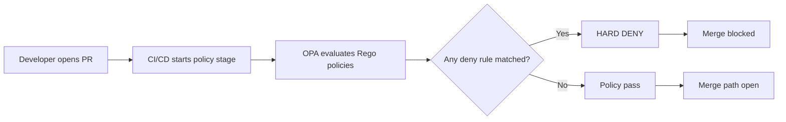
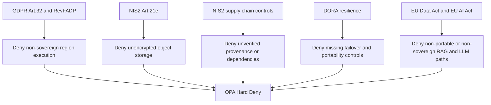
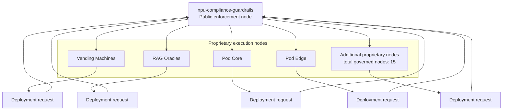

# 29TH REGIME // SOVEREIGNTY PROTOCOL SPECIFICATION

## Doctrine
Governance is a legal fiction. Sovereignty is a technical enforcement.

This repository defines enforcement law, not advisory guidance. Compliance is not represented as narrative policy, spreadsheet controls, or retrospective audit artifacts. Compliance is represented as deterministic code execution at CI/CD ingress.

## The Friction (The Legal Fiction)
The prevailing enterprise model treats legal obligations as interpretive documentation. This model fails at runtime.

### GDPR (EU) and RevFADP (Swiss)
Data residency is routinely implemented as a preference flag or architecture intention. In most stacks, region boundaries are soft and reversible under operator pressure. This violates the principle of deterministic territorial control for regulated data handling.

### NIS2 (EU)
Supply chain integrity and encryption requirements are frequently measured post-deployment via periodic audit, then accepted as remediation backlog. This converts mandatory controls into deferred paperwork and permits non-compliant infrastructure to enter production.

### DORA (EU)
Operational resilience, dependency concentration, and exit readiness are commonly treated as board-level governance topics rather than deployment-time gates. Multi-cloud exit strategy remains aspirational until outage or legal trigger.

### EU Data Act and EU AI Act
Sovereign control over LLM data paths, including RAG ingestion and retrieval boundaries, is often compromised by vendor lock-in primitives. Cloud-switching portability and model data control are weakened by proprietary interfaces and opaque egress assumptions.

## The Liquidation (The Engine)
The Sovereign Gate is a policy execution boundary implemented in CI/CD using Open Policy Agent (OPA) and .rego controls. Every change request is evaluated against deterministic deny rules before merge.

### Enforcement Flow (Deterministic)

### Enforcement Primitive
- Policy engine: Open Policy Agent (OPA)
- Policy language: Rego
- Execution point: Pull request and deployment pipelines
- Decision model: Hard Deny on policy violation

No exception path exists inside the gate itself. Non-compliant state is rejected at build time.

### Legal-to-Code Mapping
- GDPR Article 32 / RevFADP security principles:
  - Hard block when execution geography is outside approved sovereign regions.
  - Example rule class: deny when deployment region is not pinned to eu-central-1 or ch-north (or approved sovereign equivalent).
- NIS2 Article 21(e) encryption controls:
  - Hard block on unencrypted object storage.
  - Example rule class: deny when storage encryption-at-rest is disabled (for example, unencrypted S3-compatible buckets).
- NIS2 supply chain control set:
  - Hard block for unverified provenance paths and unsigned/untrusted pipeline dependencies.
- DORA resilience and concentration risk obligations:
  - Hard block when failover and provider portability controls are absent from deployment topology.
- EU Data Act / EU AI Act portability and control:
  - Hard block when RAG/LLM data paths violate declared sovereign boundaries or portability constraints.

## The Hierarchy
The enforcement model is centralized and physically applied.

One public enforcement node, npu-compliance-guardrails, governs fifteen proprietary execution nodes. These include:
- Vending Machines (infrastructure vending and provisioning layers)
- Pods (runtime operational nodes)
- RAG Oracles (retrieval and inference control planes)

The proprietary nodes do not self-attest compliance. They are subordinated to this public enforcement node through reusable workflow invocation and policy test execution. The hierarchy is therefore executable, not rhetorical.

## Runtime Contract
- If policy passes: merge path remains open.
- If policy fails: merge path is blocked.
- If auditors request evidence: provide policy source, test evidence, and workflow execution logs.

No PDF is authoritative. Policy code and test outcomes are authoritative.

## Verification
Do not trust this document. The math is the proof. Inspect the /policies and /tests directories to verify the enforcement.
