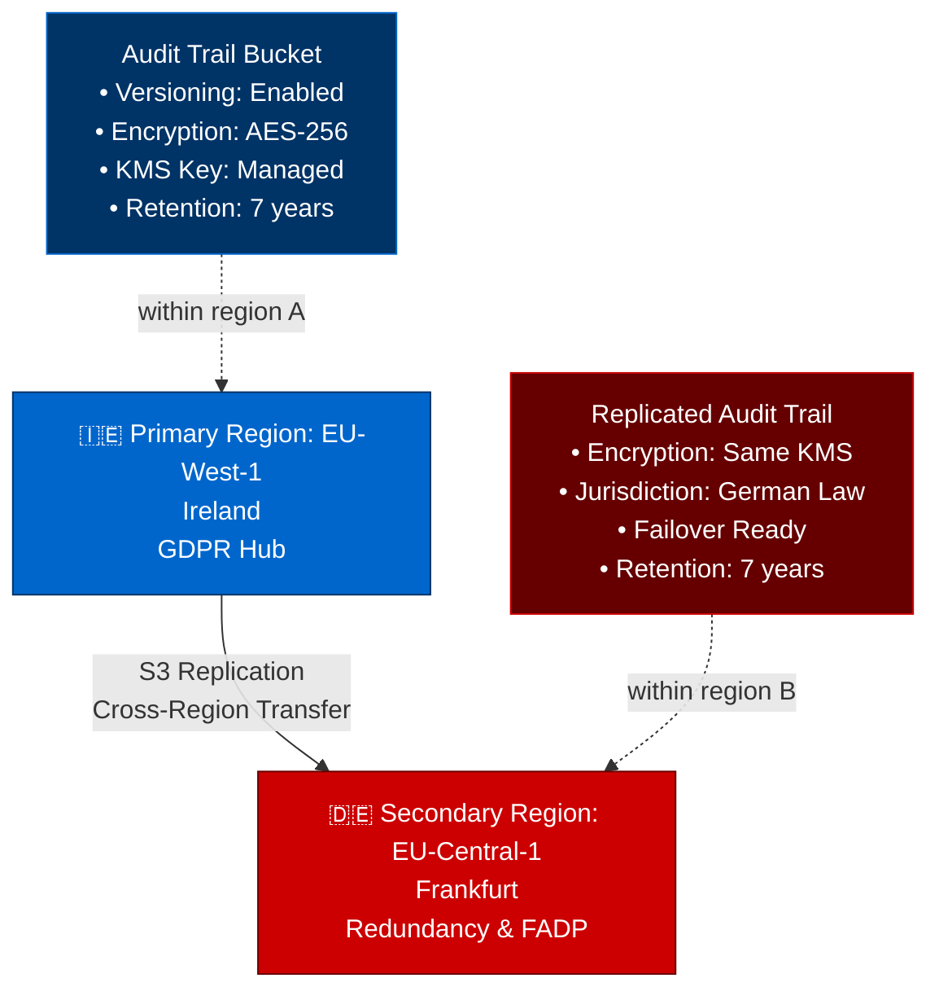

# Multi-Region EU Deployment: 29th Regime Example

## Overview

This Terraform configuration demonstrates deterministic, sovereignty-enforcing deployment across two EU regions: **EU-West-1 (Ireland)** and **EU-Central-1 (Frankfurt)**.

The architecture ensures:
- ✅ GDPR Article 32 compliance (data residency, encryption, audit trails)
- ✅ NIS2 Article 21(e) encryption enforcement (at rest and in transit)
- ✅ Cross-region replication for redundancy without leaving the EU
- ✅ Deterministic audit trail enforcement

## Architecture



## Module Composition

### Primary Region (EU-West-1)
- **Module**: `npu-sovereign-logging-s3`
- **Purpose**: Audit trail generation and retention
- **Encryption**: KMS-managed keys (EU-created)
- **Versioning**: Enabled (immutability for compliance)
- **Retention**: 2555 days (7 years, GDPR requirement)

### Secondary Region (EU-Central-1)
- **Module**: `npu-sovereign-logging-s3` (reused)
- **Purpose**: Failover redundancy and legal diversity
- **Replication**: From primary via S3 Replication Configuration
- **Encryption**: Same KMS keys (cross-region trust)
- **Jurisdiction**: German law (FADP Art. 7, RevFADP)

## Deployment Steps

### 1. Configure Variables

Edit `terraform.tfvars`:
```hcl
environment     = "prod"
primary_region  = "eu-west-1"
secondary_region = "eu-central-1"
```

### 2. Initialize Terraform

```bash
terraform init -backend-config=config.s3.tfbackend
```

**Backend must be in approved EU region** (validated by OPA policy).

### 3. Plan

```bash
terraform plan -out=tfplan
```

**The plan will be evaluated by Terraform Cloud policy** (`npu-compliance-guardrails`):
- ✅ Both regions must be in `allowed_eu_regions`
- ✅ All S3 buckets must have encryption at rest
- ✅ All buckets must have versioning enabled

### 4. Apply

```bash
terraform apply tfplan
```

If any resource violates policy, the apply will fail with a hard deny.

## Expected Outputs

After `terraform apply`:

```
Outputs:

primary_bucket_name = "29th-regime-audit-primary-eu-west-1-xxxxx"
primary_bucket_arn  = "arn:aws:s3:::29th-regime-audit-primary-eu-west-1-xxxxx"

secondary_bucket_name = "29th-regime-audit-secondary-eu-central-1-xxxxx"
secondary_bucket_arn  = "arn:aws:s3:::29th-regime-audit-secondary-eu-central-1-xxxxx"

replication_role_arn = "arn:aws:iam::xxxxxxxxxxxx:role/29th-regime-s3-replication-role"
```

## Enforcement

### What Gets Blocked

This deployment will **hard-deny** if:

1. **Wrong region**:
   ```
   DETERMINISTIC DENY: Resource 'bucket-name' deployed to non-EU region 'us-east-1'. Violates GDPR Article 32.
   ```

2. **Missing encryption**:
   ```
   DETERMINISTIC DENY: Storage account 'bucket-name' lacks encryption at rest. Violates GDPR Article 32(1)(a).
   ```

3. **Unversioned bucket**:
   ```
   DETERMINISTIC DENY: Bucket 'bucket-name' does not have versioning enabled. Violates audit trail immutability.
   ```

### What Gets Allowed

- ✅ EU-West-1 (Ireland), EU-Central-1 (Frankfurt), EU-North-1 (Sweden), EU-Central-2 (Poland), etc.
- ✅ AES-256 encryption at rest
- ✅ S3 versioning + replication
- ✅ KMS keys created in approved EU regions

## Compliance Mapping

| Requirement | Implementation |
|---|---|
| **GDPR Art. 32(1)(a)**: Encryption at rest | AWS KMS + S3-side encryption (AES-256) |
| **GDPR Art. 32(1)(b)**: Encryption in transit | AWS S3 TLS enforcement + S3 RTC |
| **GDPR Art. 32(1)(c)**: Audit trails | S3 versioning + CloudTrail logging |
| **GDPR Art. 32(1)(d)**: Data residency | Hardcoded EU regions in policy + provider limits |
| **NIS2 Art. 21(e)**: Encryption | Enforced at Terraform apply time |
| **RevFADP Art. 7**: Geo-diversity | Primary in IE, Secondary in DE |

## Troubleshooting

### "DETERMINISTIC DENY: Resource deployed to non-EU region"

**Cause**: You specified a region outside the approved list.

**Fix**: Use only:
- `eu-west-1` (Ireland)
- `eu-central-1` (Frankfurt)
- `eu-north-1` (Stockholm)
- `eu-central-2` (Poland/Warsaw)
- `eu-west-2` (London — UK after Brexit check)
- `eu-west-3` (Paris)

### "Replication configuration failed"

**Cause**: Secondary bucket not in same account or different KMS key.

**Fix**: Ensure both buckets are in same AWS account and use same KMS key for encryption.

### "Apply failed: policy check"

**Cause**: Your Terraform Cloud workspace is not linked to the `npu-compliance-guardrails` policy set.

**Fix**: In Terraform Cloud, attach the policy set:
```
Organization: 29th-regime-oss
Policy Set: npu-compliance-guardrails
Enforcement Level: hard-mandatory
```

## Further Reading

- [29th Regime Specification](../../SPECIFICATION.md)
- [Data Residency Policy](../../policies/sovereignty/data_residency.rego)
- [Encryption Policy](../../policies/security/encryption_at_rest_transit.rego)
- [Architecture Overview](../../README.md)

---

**Architecture is Law. Sovereignty is Deterministic.**
